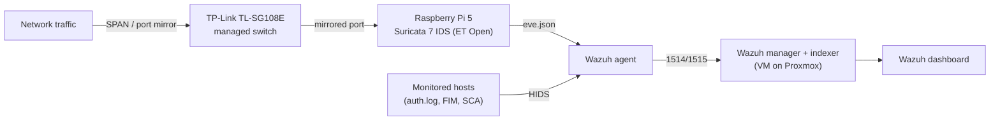

# Santry SOC — Home Security Operations Center

A self-built home SOC lab for hands-on **Blue Team / SOC Analyst** skills: a passive
network IDS feeding a SIEM, host-based monitoring on every asset, and **real,
documented incidents** — not tutorials followed step by step.

> Built as a career-transition portfolio project. Every phase was verified by
> artifact (logs, hashes, exit codes), and every incident is written up like a
> real case.

---

## Architecture

**Detection in two layers, on purpose:**
- **NIDS** — Suricata on the Pi, passive on a switch mirror port, ~52k ET Open rules.
- **HIDS** — Wazuh agents on the hosts, reading auth logs, file integrity, and
  security-configuration assessment.

---

## Stack

| Layer | Tech |
|---|---|
| IDS sensor | Suricata 7.0 on Raspberry Pi 5 (NVMe, Debian) |
| SIEM | Wazuh 4.14 (manager + indexer + dashboard) on a Proxmox VM |
| Virtualization | Proxmox VE (VMs + LXC) |
| Network | TP-Link TL-SG108E (managed, port mirroring) |
| Attacker / analysis | Fedora workstation (hydra, nmap) |

---

## What this lab demonstrates

- Designing and building an end-to-end detection pipeline on modest hardware.
- **Sensor placement analysis** — understanding *what a sensor can and cannot see*
  (see INC-0001: a lateral attack invisible to the NIDS but caught by the HIDS).
- Incident detection, triage, and write-up mapped to **MITRE ATT&CK**.
- Evidence handling and chain of custody (hashing artifacts).
- Verification discipline: *"I think I did it" is not a state — verify by artifact.*

---

## Documented incidents

| ID | Title | Technique | Outcome |
|---|---|---|---|
| [INC-0001](docs/INC-0001_Brute-Force-SSH.md) | SSH brute-force with credential compromise | T1110.001 | Detected in ~13s (HIDS); NIDS blind-spot identified |

**INC-0001 in one line:** an SSH brute-force cracked a weak credential in ~13
seconds; the SIEM flagged the **compromise** (not just the attempts) via a level-12
correlation rule — while revealing that the network sensor was blind to the
lateral traffic. Full write-up in [`docs/INC-0001_Brute-Force-SSH.md`](docs/INC-0001_Brute-Force-SSH.md).

---

## Roadmap

- **INC-0001b** — remediate the NIDS blind spot (extend the switch mirror to the
  server segment) and re-validate the same attack against the network sensor.
- Harden targets — key-only SSH, Fail2Ban, active alerting on level ≥12.
- Generate further incidents by technique, using *Python for Cybersecurity*
  (one MITRE technique → one documented INC).

---

## See also

- [Architecture & build notes](docs/ARCHITECTURE.md)

---

> **Note on addresses:** IP addresses in this repo use the documentation range
> `192.0.2.0/24` (RFC 5737). They are illustrative, not the lab's real addresses.
