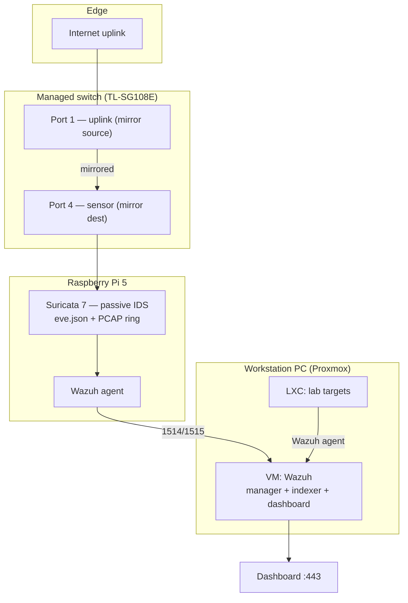

# Architecture & Build Notes

## Goal

A home Security Operations Center (SOC) that produces **real detection** on modest
hardware, to build and demonstrate Blue Team / SOC-analyst skills. Version 0.1
delivers an end-to-end pipeline plus one fully documented incident (INC-0001).

## Design

## Assets

| Asset | Role |
|---|---|
| Raspberry Pi 5 (NVMe, Debian) | Suricata IDS sensor + Wazuh agent |
| TP-Link TL-SG108E | Managed switch, port mirroring |
| Workstation PC (Ryzen 9) | Dual-boot: daily Linux / Proxmox VE hypervisor |
| VM (Debian) | Wazuh 4.14 all-in-one SIEM (static IP `192.0.2.32`) |
| LXC (Debian) | Disposable lab targets |
| Fedora laptop | Attacker / analysis workstation |

## Detection layers

- **NIDS — Suricata** on the Pi, passive on the switch mirror port, ~52k ET Open
  rules. Sees north-south (uplink) traffic. *Known limitation:* blind to east-west
  traffic under the current uplink-only SPAN (see INC-0001 §8).
- **HIDS — Wazuh agents** on hosts: authentication logs (SSH brute-force rules),
  file-integrity monitoring, and security-configuration assessment (CIS).

## Engineering decisions (selected)

- **Static IP for the SIEM** — the agents record the manager address; a DHCP lease
  that moves would break enrolment. Made static at the host (ifupdown), with DNS
  pinned (a `dhcpcd` hook had been blanking `resolv.conf` on boot).
- **Log rotation for `eve.json`** — the shipped Suricata logrotate had no cadence
  (fell back to weekly); tuned to daily + compression, keeping the agent's read
  intact via `copytruncate`.
- **Version parity** — Wazuh agent and manager pinned to the same 4.14.x.
- **Capacity note** — the SIEM VM runs at the 8 GiB minimum; with heavy `flow`
  logging the indexer is the first bottleneck. Mitigation: trim Suricata's
  `eve.json` to `alert` only, or raise VM RAM.

## Verification discipline

Every phase was closed by **artifact**, not by reading the screen — partition
signatures, file hashes, service state with real events on disk, exit codes. A
diagram is not an inventory; only evidence on the machine counts.

## Roadmap

1. **INC-0001b** — extend the mirror to the server segment; re-validate the NIDS.
2. Harden targets (key-only SSH, Fail2Ban, active alerting ≥ level 12).
3. Further incidents by MITRE technique (scanning, etc.).

---

> Addresses use the RFC 5737 documentation range `192.0.2.0/24` and are illustrative.
